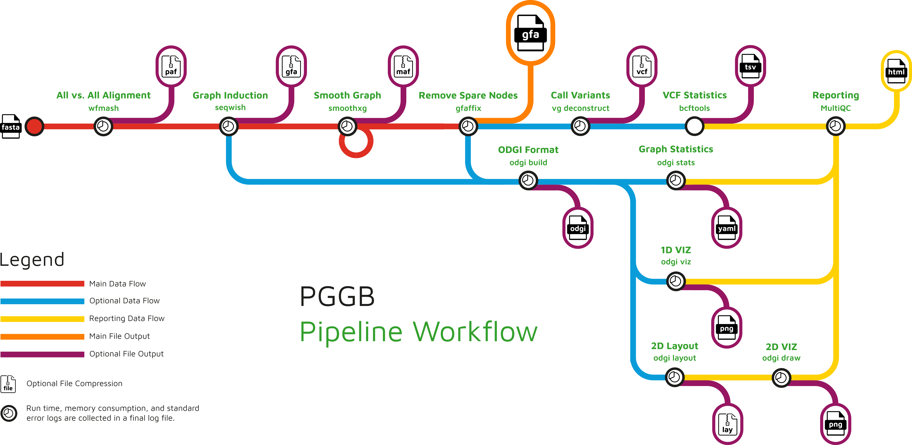

# Hướng Dẫn Kỹ Thuật & Quy Trình Đầu Vào Cho PGGB (Pangenome Graph Builder)

Tài liệu này tổng hợp kiến thức nền tảng, định dạng dữ liệu đầu vào chuẩn và quy trình xử lý dữ liệu trước khi đưa vào **PGGB (Pangenome Graph Builder)**.

---

## 1. Giới Thiệu & Nhóm Phát Triển

*   **Tên công cụ:** PGGB (Pangenome Graph Builder).
*   **Nhóm phát triển:** Được phát triển bởi **TS. Erik Garrison** (Đại học Tennessee Health Science Center - UTHSC), **TS. Andrea Guarracino** (UTHSC / HPRC) cùng các cộng sự thuộc Liên minh Tham chiếu Pangenome Người (**Human Pangenome Reference Consortium - HPRC**).
*   **Mục đích chính:** Dựng đồ thị pangenome (Variation Graph - GFA) **hoàn toàn không phụ thuộc vào hệ gen tham chiếu (Reference-free)**, coi mọi haplotype đầu vào có vai trò di truyền bình đẳng và bảo tồn đầy đủ các biến dị cấu trúc (SVs).

---

## 2. Bản Chất Dữ Liệu Đầu Vào Của PGGB

Đầu vào chính thức của PGGB là **một tệp multi-FASTA** (nén `.fa.gz` hoặc `.fasta.gz`) cùng tệp chỉ mục `.fai` đi kèm.

> [!IMPORTANT]
> **Yêu cầu nguồn gốc dữ liệu FASTA:**
> Tệp FASTA đầu vào phải là kết quả **Lắp Ráp De Novo (De Novo Assembly)** từ dữ liệu đọc dài (**Long-Reads**: PacBio HiFi hoặc Oxford Nanopore). 
> PGGB **không nhận trực tiếp tệp đọc thô FASTQ**.

---

## 3. Quy Chuẩn Đặt Tên Chuỗi PanSN (PanSN Convention)

Để PGGB nhận diện chính xác mẫu và đường đi (Walks/Paths) trên đồ thị, tiêu đề (header) của từng chuỗi FASTA trong tệp gộp **bắt buộc** phải tuân theo chuẩn **PanSN (Pangenome Sequence Naming)**:

$$\text{><sample>\#<haplotype>\#<contig\_name>}$$

*   `sample`: Tên mẫu / chủng sinh vật (ví dụ: `IPO323`, `Zt09`).
*   `haplotype`: Chỉ số bộ đơn / bộ nhiễm sắc thể (ví dụ: `1` cho đơn bội, `1` hoặc `2` cho lưỡng bội).
*   `contig_name`: Tên đoạn contig hoặc nhiễm sắc thể (ví dụ: `chr01`, `ctg0001`).

*Ví dụ tiêu đề chuẩn:*
```text
>IPO323#1#chr01
ACGTACGT...
>Zt09#1#chr01
ACGTACGT...
```

---

## 4. Quy Trình Chuẩn Bị Dữ Liệu Đầu Vào Cho PGGB

Dưới đây là sơ đồ quy trình làm việc chính thức của PGGB tích hợp các công cụ tin sinh học cấu thành:

> [!NOTE]
> Xem chi tiết lý thuyết và hướng dẫn các công cụ thành phần (`wfmash`, `seqwish`, `smoothxg`, `odgi`, `gfaffix`, `vg`) tại [pggb_tools_guide.md](pggb_tools_guide.md).



*(Tệp hình ảnh lưu tại: [documents/images/pggb_workflow_tools.png](file:///home/vkhang-bui/1.HocViec/projects/pangenom/documents/images/pggb_workflow_tools.png))*

### Các bước câu lệnh thực thi mẫu:

1.  **Đổi tên tiêu đề FASTA sang chuẩn PanSN & định danh Contigs:**
    *   *Cách 1: Dùng lệnh `sed` (Bash thuần):*
        ```bash
        sed -i 's/^>/>sampleA#1#ctg_/g' sampleA.fasta
        ```
    *   *Cách 2: Dùng `seqkit replace` (Nhanh & An toàn - Khuyên dùng):*
        ```bash
        seqkit replace -p "^" -r "sampleA#1#ctg_" sampleA.fasta -o sampleA_pansn.fasta
        ```

2.  **Gộp tệp, nén bgzip và tạo chỉ mục fai:**
    ```bash
    cat *_pansn.fasta > all_samples.fasta
    bgzip -@ 8 all_samples.fasta
    samtools faidx all_samples.fasta.gz
    ```

3.  **Khởi chạy PGGB:**
    ```bash
    pggb -i all_samples.fasta.gz -n 9 -p 98 -s 5000 -t 16 -o pggb_output/
    ```

---

## Tài Liệu Tham Khảo (References)

1. **Garrison, E., Guarracino, A., Heumos, S., et al. (2023).** *Building pangenome graphs.* bioRxiv, 2023.04.05.535718. [https://doi.org/10.1101/2023.04.05.535718](https://doi.org/10.1101/2023.04.05.535718)
2. **PanSN Specification (HPRC):** *Pangenome Sequence Naming standard convention.* GitHub Repository. [https://github.com/pangenome/PanSN-spec](https://github.com/pangenome/PanSN-spec)
3. **Cheng, H., Concepcion, G. T., Feng, X., Zhang, H., & Li, H. (2021).** *Haplotype-resolved de novo assembly of diploid genomes with hifiasm.* Nature Methods, 18(2), 170-175. [https://doi.org/10.1038/s41592-020-01056-5](https://doi.org/10.1038/s41592-020-01056-5)
4. **Tài liệu dự án liên quan:** [pggb_tools_guide.md](pggb_tools_guide.md), [lo_trinh_hoc_pangenome.md](lo_trinh_hoc_pangenome.md) và [pangenome_theory_guide.md](pangenome_theory_guide.md).
