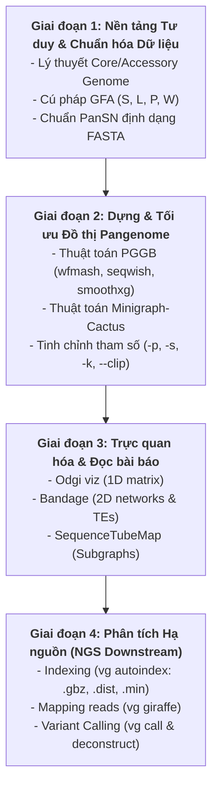

# Lộ Trình Học Tập Và Master Pangenomics (Pangenomics Learning Roadmap)

Tài liệu này đề xuất lộ trình học tập bài bản từ lý thuyết nền tảng đến kỹ năng thực hành phân tích nâng cao, thiết kế dành riêng cho đối tượng **Nấm (Fungi)** và **Người (Humans)**.

---

## 1. Điều Đầu Tiên Trong Việc Học Pangenome Là Gì?

Điều đầu tiên không phải là gõ lệnh phần mềm, mà là **Chuyển Đổi Tư Duy Di Truyền (Mindset Shift)**:
*   Từ tư duy **Hệ gen tuyến tính (Linear Genome Mindset)**: Ép mọi cá thể vào 1 hệ gen chuẩn cố định $\rightarrow$ bỏ sót biến dị lớn, tạo sai lệch tham chiếu (Reference bias).
*   Sang **Tư duy Đồ thị biến dị (Graph Mindset)**: Coi di truyền là một mạng lưới các đoạn đường (Nodes) nối với nhau (Edges), nơi mọi cá thể đều đóng góp các đường đi (Paths/Walks) bình đẳng.
*   Hiểu bản chất toán học của **Định dạng GFA (v1.0 & v1.1)** trước khi đụng vào bất kỳ dòng lệnh nào.

---

## 2. Lộ Trình Học Tập 4 Giai Đoạn

---

### Giai Đoạn 1: Nền Tảng Lý Thuyết & Định Dạng Dữ Liệu
*   **Mục tiêu:** Nắm vững ngôn ngữ chung của Pangenomics.
*   **Nội dung học:**
    1.  Khái niệm *Core Genome* (Gen lõi), *Accessory Genome* (Gen phụ trợ), và *Unique Genome*.
    2.  Cấu trúc file GFA: Phân biệt `S` (Segment), `L` (Link), `P` (Path), `W` (Walk).
    3.  Quy chuẩn định dạng tên chuỗi FASTA theo **PanSN**: `<sample>#<haplotype>#<contig>` (Ví dụ: `>IPO323#1#chr05`).
*   **Sản phẩm:** Đọc hiểu thành thạo cú pháp một file GFA mẫu nhỏ.

### Giai Đoạn 2: Kỹ Thuật Xây Dựng Đồ Thị (Graph Construction)
*   **Mục tiêu:** Biết cách làm chủ các công cụ tạo đồ thị pangenome từ tập hợp các file FASTA lắp ráp.
*   **Nội dung học:**
    1.  Luồng làm việc của **PGGB** (Reference-free):
        *   `wfmash`: Căn chỉnh pairwise giữa các bộ gen theo ngưỡng độ tương đồng `-p` và độ dài cửa sổ `-s`.
        *   `seqwish`: Xây dựng đồ thị thô từ kết quả căn chỉnh alignment.
        *   `smoothxg`: Chuẩn hóa và làm mịn đồ thị bằng Partial Order Alignment (POA).
    2.  Luồng làm việc của **Minigraph-Cactus** (Reference-centric): Dựng khung biến dị cấu trúc trước, bổ sung base-level sau.
    3.  Thực hành tinh chỉnh tham số: Nhận biết khi nào đồ thị bị thừa/thiếu căn chỉnh (under/over-aligned).
*   **Sản phẩm:** Tạo thành công file đồ thị `zt_pggb.gfa` hoặc `zt_mc.gfa` cho các bộ gen nấm.

### Giai Đoạn 3: Trực Quan Hóa & Kỹ Năng Đọc Hiểu Biểu Đồ Báo Cáo
*   **Mục tiêu:** Có khả năng đọc, giải thích và vẽ các biểu đồ trong bài báo khoa học.
*   **Nội dung học:**
    1.  **Odgi (1D Diagnostics):** Chạy `odgi viz` để xuất ảnh ma trận 1D. Đọc hiểu các vùng bảo tồn, đảo đoạn, và mất đoạn.
    2.  **Bandage (2D Network):** Mở file GFA trên Bandage. Nhận diện các bong bóng biến dị (bubbles), vòng lặp lặp lại (repeats/TEs), và các nút quắn phức tạp (tangles).
    3.  **SequenceTubeMap:** Trực quan hóa các đồ thị con (subgraphs) chứa cụm gen quan tâm.
*   **Sản phẩm:** Đọc hiểu và giải thích được các hình vẽ đồ thị trong bài báo *Matthews et al. (2024)*.

### Giai Đoạn 4: Ứng Dụng Thực Tế Hạ Nguồn (Downstream Applications)
*   **Mục tiêu:** Ứng dụng Pangenome vào phân tích dữ liệu giải trình tự thế hệ mới (NGS short-reads/long-reads).
*   **Nội dung học:**
    1.  **Graph Indexing:** Dùng `vg autoindex` tạo các tệp `.gbz`, `.dist`, `.min`.
    2.  **Read Mapping:** Dùng `vg giraffe` căn chỉnh FASTQ trực tiếp lên chỉ mục đồ thị.
    3.  **Surjection:** Dùng `vg surject` chiếu kết quả từ đồ thị về BAM tuyến tính.
    4.  **Variant Calling:** Dùng `vg deconstruct` và `vg call` trích xuất file VCF chứa cả SNPs và Structural Variants (SVs).
    5.  **Ứng dụng trên Nấm:** Trích xuất cụm gen chuyển hóa thứ cấp (Secondary Metabolite Gene Clusters) hoặc vùng gen kháng thuốc.

---

## 3. Tài Liệu Học Tập Khuyên Dùng
1. **Bài báo lý thuyết:** [documents/pangenome_theory_guide.md](file:///mnt/d/1.HocViec/theory_and_resources/pangenom/documents/pangenome_theory_guide.md).
2. **Bài báo tổng quan:** *Matthews et al. (2024)* [Matthews et al. - 2024 - A gentle introduction to pangenomics.pdf](file:///mnt/d/1.HocViec/theory_and_resources/pangenom/reference/Matthews%20et%20al.%20-%202024%20-%20A%20gentle%20introduction%20to%20pangenomics.pdf).
3. **Thực hành mẫu:** Tài liệu [reference/Giới thiệu hướng dẫn - Cuộc thi lập trình Pangenome Hackathon.html](file:///mnt/d/1.HocViec/theory_and_resources/pangenom/reference/Gi%E1%BB%9Bi%20thi%E1%BB%87u%20h%C6%B0%E1%BB%9Bng%20d%E1%BA%ABn%20-%20Cu%E1%BB%99c%20thi%20l%E1%BA%ADp%20tr%C3%ACnh%20Pangenome%20Hackathon.html).
