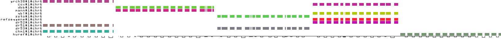
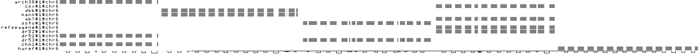
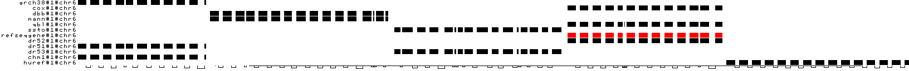
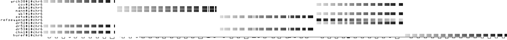
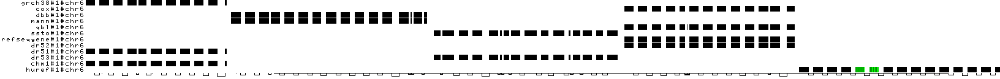
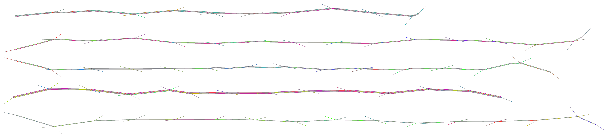

# Cẩm Nang Chi Tiết Đọc Hiểu & Chẩn Đoán Sơ Đồ Ma Trận 1D (ODGI Viz Guide)

Tài liệu này tổng hợp toàn bộ khung lý thuyết, thuật toán chiếu 1D, quy trình đọc sơ đồ 4 bước, kỹ năng phân tích sinh học, hình ảnh minh họa thực tế và danh sách câu lệnh dòng lệnh (Bash CLI) cho các sơ đồ trực quan hóa đồ thị Pangenome bằng **ODGI (Open Directed Graph Interface)**.

---

## 1. Khái Niệm Cốt Lõi & Động Lực Thuật Toán (1D Projection)

### 1.1. Vấn Đề "Búi Tóc Rối" (Hairball Problem)
Một đồ thị Pangenome (dạng GFA) là một đồ thị có hướng phức tạp gồm hàng triệu nút (nodes) và cạnh (edges). Nếu hiển thị đồ thị này dưới dạng mạng lưới 2D/3D thông thường, dữ liệu sẽ bị chồng lấp tạo thành một "búi tóc rối" rất khó phân tích.

### 1.2. Giải Pháp Chiếu 1D Với Thuật Toán PG-SGD
`odgi viz` giải quyết bài toán này bằng cách nén và chiếu (project) đồ thị đa chiều về một **hệ tọa độ tuyến tính 1 chiều (1D linear ordering)** của các nút theo thuật toán **Path-Guided Stochastic Gradient Descent (PG-SGD)** (`odgi sort`).

* **Hàm mất mát (Loss Function) của PG-SGD:**
  Thuật toán coi đường đi của các Haplotype (Paths) làm thước đo khoảng cách. Nếu nút $A$ và nút $B$ thường xuyên xuất hiện cạnh nhau trên cùng các haplotype, khoảng cách 1D trên trục X giữa chúng $d_{1D}(A, B)$ phải được tối thiểu hóa:
  $$E = \sum_{p \in \text{Paths}} \sum_{u, v \in p} \left( |x_u - x_v| - \delta_p(u, v) \right)^2$$
  *Trong đó: $x_u, x_v$ là tọa độ 1D của nút $u$ và $v$ trên trục X; $\delta_p(u, v)$ là khoảng cách nucleotide thực tế giữa $u$ và $v$ trên haplotype $p$.*

---

## 2. Cấu Trúc Ma Trận 1D

Một sơ đồ ma trận 1D (`odgi viz`) bao gồm 3 thành phần chính:

| Thành phần | Chi tiết kỹ thuật & sinh học |
| :--- | :--- |
| **Trục X (Cột / Columns)** | Biểu diễn các **Nút (Nodes - đoạn ADN)** đã được xếp thứ tự 1D từ $1 \rightarrow N$.<br/>• *Proportional Width (Mặc định):* Độ rộng cột tỉ lệ với độ dài nucleotide của node.<br/>• *Fixed Width (`-w`):* Mỗi node có độ rộng ô bằng nhau (dùng để soi SNPs/Indels nhỏ). |
| **Trục Y (Hàng / Rows)** | Mỗi hàng đại diện cho **1 Haplotype/Genome** đầu vào (theo chuẩn PanSN: `<sample>#<haplotype>#<contig>`). |
| **Ô ma trận $(i, j)$** | Điểm giao giữa Haplotype $i$ và Node $j$. Nếu Haplotype $i$ đi qua Node $j$, ô này sẽ được tô màu. Nếu không đi qua, ô sẽ bỏ trống (màu trắng). |

---

## 3. Quy Trình 4 Bước Đọc Bất Kỳ Sơ Đồ Ma Trận 1D (`odgi viz` Cheatsheet)

```text
  BƯỚC 1: Đọc 2 Trục  ──►  BƯỚC 2: Xem Chế Độ Màu  ──►  BƯỚC 3: Dóng Hàng Cột  ──►  BƯỚC 4: Tổng Hợp Sinh Học
  (Trục X & Trục Y)        (Mẫu / Depth / Inversion)    (Tìm Core, SV, Repeat)      (Kết luận Clades, QC)
```

---

## 4. Giải Thích Cặn Kẽ Cách Đọc Từng Loại Sơ Đồ & Phân Tích Thực Tế

---

### 4.1. Ma Trận Mẫu Haplotype & Cấu Trúc Pangenome (`odgi viz -M`)



#### A. Ý nghĩa màu sắc & Chế độ tô màu
* **Chế độ:** Tô màu theo mẫu (`-M / --multiqc`).
* **Mục đích:** Giúp phân biệt bằng mắt thường đường đi của từng cá thể (haplotype) qua các nút trên Trục X.
* **Quy ước màu sắc từng mẫu (12 Haplotypes):**
  * 🟣 **Hồng tím (Magenta):** `grch38#1#chr6` (Hệ gen tham chiếu chuẩn GRCh38)
  * 🟤 **Nâu xám (Brown):** `dr51#1#chr6` (Haplotype nhóm DR51)
  * 🟢 **Xanh ngọc (Teal):** `chm1#1#chr6` (Dòng tế bào đơn bộ CHM1)
  * 🟢 **Xanh lá tươi (Lime Green):** `dbb#1#chr6` (Haplotype nhóm DR53)
  * 💖 **Hồng tươi (Pink):** `mann#1#chr6` (Haplotype nhóm DR53)
  * 🟢 **Xanh lá nhạt (Green):** `ssto#1#chr6` (Haplotype nhóm DR53)
  * ⬛ **Xám đen (Dark Gray):** `dr53#1#chr6` (Haplotype nhóm DR53)
  * 🟡 **Vàng chanh (Yellow-Green):** `qbl#1#chr6` (Haplotype nhóm DR52)
  * 🔴 **Đỏ (Red):** `refseqgene#1#chr6` (Chuỗi chú giải NCBI RefSeq)
  * 🟣 **Tím tươi (Purple):** `dr52#1#chr6` (Haplotype nhóm DR52)
  * 🟣 **Hồng tím sẫm (Dark Magenta):** `cox#1#chr6` (Haplotype nhóm DR52)
  * 🟢 **Xanh rêu (Olive Green):** `huref#1#chr6` (Bộ gen cá nhân của Craig Venter)

#### B. Hướng dẫn đọc cặn kẽ từng bước
1. **Quét dọc theo từng cột (Trục X):** Tìm các cột có dải màu kéo dài từ trên xuống dưới.
   * Cột màu kín 100% hàng $\rightarrow$ **Core Node (Gen lõi bảo tồn)**.
   * Cột bị khuyết ô trắng $\rightarrow$ **Accessory Node (Gen phụ trợ / Biến thể cấu trúc)**.
2. **Quét ngang theo từng hàng (Trục Y):** Tìm các ô trắng ngắt quãng $\rightarrow$ Biến thể **Mất đoạn (Deletion)** ở mẫu đó.

#### C. Phân tích kết quả thực tế trên tệp dữ liệu `DRB1-3123`
* **Phát hiện 1: Core Genome = 0%**
  Dóng dọc tất cả các cột từ trái sang phải, **không có bất kỳ vị trí nào có dải ô màu phủ kín cả 12 hàng**. Tất cả các nút ở locus này đều là Accessory Genome.
* **Phát hiện 2: Phân mảnh thành 5 Khối Cấu trúc Cột (Trục X)**
  * *Khối 1 (Cực Trái):* Độc quyền cho nhóm `grch38`, `dr51`, `chm1`.
  * *Khối 2 (Giữa Trái):* Độc quyền cho nhóm `dbb`, `mann`.
  * *Khối 3 (Chính Giữa):* Độc quyền cho nhóm `ssto`, `dr53`.
  * *Khối 4 (Giữa Phải):* Độc quyền cho nhóm `cox`, `qbl`, `refseqgene`, `dr52`.
  * *Khối 5 (Cực Phải):* Độc quyền cho mẫu cá nhân `huref`.
* **Phát hiện 3: Tự động gom thành 3 Nhóm Di Truyền Haplotype lớn (Trục Y)**
  * *Nhóm I (DR1/51):* Mang Khối 1 (`grch38`, `dr51`, `chm1`).
  * *Nhóm II (DR53):* Mang Khối 2 + Khối 3 (`dbb`, `mann`, `ssto`, `dr53`).
  * *Nhóm III (DR52):* Mang Khối 4 + Khối 5 (`cox`, `qbl`, `refseqgene`, `dr52`, `huref`).
* **Ý nghĩa sinh học:** Locus MHC `DRB1-3123` là vùng siêu biến động cấu trúc. Đồ thị Pangenome đã giải quyết triệt để vấn đề sai lệch tham chiếu (**Reference Bias**) của hệ gen tuyến tính chuẩn `GRCh38` bằng cách tích hợp cả 5 phân khu di truyền này vào 1 đồ thị duy nhất.

---

### 4.2. Ma Trận Độ Sâu & Số Lượng Bản Sao CNVs (`odgi viz -d`)



#### A. Ý nghĩa màu sắc & Chế độ tô màu
* **Chế độ:** Tô màu theo độ sâu bao phủ nút (`-d / --depth` - Grayscale mode).
* **Quy ước màu sắc:**
  * ⬜ **Màu Trắng:** Depth = 0 (Ô trống / Mất đoạn / Unvisited).
  * ⬛ **Màu Xám Nhạt (Light Gray):** Depth = 1 (**Single-copy** — Haplotype chỉ đi qua nút đó đúng 1 lần).
  * ⬛ **Màu Xám Đậm / Đen (Dark Gray / Black):** Depth $\ge 2$ (**Multi-copy** — Haplotype đi qua nút đó 2, 3 hoặc nhiều lần).

#### B. Hướng dẫn đọc cặn kẽ từng bước
1. So sánh độ đậm nhạt của ô màu giữa các mẫu để phát hiện **Biến thể số lượng bản sao (Copy Number Variation - CNV gain/loss)**.
2. Tìm các vệt màu đen sẫm kéo dài để nhận diện các **Yếu tố di truyền lặp lại (Transposable Elements - TEs như Alu, LINE-1)**.
3. **Chẩn đoán chất lượng QC đồ thị:**
   * *Over-collapsing (Gộp nhầm node):* Xuất hiện các đốm đen bất thường khắp sơ đồ do thuật toán nén quá tay.
   * *Under-collapsing (Tách nhầm node):* Màu xám nhạt cực kỳ manh mún do thuật toán tách lỏng lẻo.

#### C. Phân tích kết quả thực tế trên tệp dữ liệu `DRB1-3123`
* **Kết quả:** 100% các ô màu hiện diện tại cả 5 phân khu đều mang **màu xám nhạt đồng nhất (uniform light gray)**.
* **Kết luận sinh học & QC:**
  1. Tất cả 12 haplotype tại các phân khu tương ứng đều mang **Single-copy (Depth = 1)**, không xảy ra biến thể nhân bản đoạn gen bất thường.
  2. Pipeline PGGB làm mịn đồ thị (`smoothxg`) đạt chất lượng cao, các node được nén chuẩn xác mà không bị lỗi gộp nhầm node (Over-collapsing).

---

### 4.3. Ma Trận Đảo Chiều Inversion $180^\circ$ (`odgi viz -z`)



#### A. Ý nghĩa màu sắc & Chế độ tô màu
* **Chế độ:** Tô màu theo chiều đọc chuỗi nucleotide (`-z / --inv`).
* **Quy ước màu sắc:**
  * ⬛ **Màu Đen:** Nút được đọc theo **chiều xuôi (`+` strand / Forward orientation)**.
  * 🔴 **Màu Đỏ:** Nút được đọc theo **chiều ngược bù (`-` strand / Reverse Complement / Inversion $180^\circ$)**.
  * ⬜ **Màu Trắng:** Depth = 0 (Ô trống).

#### B. Hướng dẫn đọc cặn kẽ từng bước
1. Quét theo từng hàng ngang để tìm các ô bôi **MÀU ĐỎ**.
2. Nếu 1 hàng xuất hiện dải màu đỏ $\rightarrow$ Đoạn gen của cá thể đó tại vị trí tương ứng bị đảo chiều $180^\circ$ so với hướng tham chiếu chuẩn.

#### C. Phân tích kết quả thực tế trên tệp dữ liệu `DRB1-3123`
* **Kết quả:** 
  * 11/12 mẫu (`grch38`, `cox`, `dbb`, `mann`, `qbl`, `ssto`, `dr52`, `dr51`, `dr53`, `chm1`, `huref`) đều mang **MÀU ĐEN TUYỀN** (đọc theo chiều xuôi `+` strand).
  * Duy nhất Hàng 7 (`refseqgene#1#chr6`) xuất hiện dải ô **MÀU ĐỎ RỰC** ở Phân khu 4.
* **Kết luận sinh học:** Trình tự gen của mẫu `refseqgene` (trích xuất từ NCBI RefSeq) tại phân khu này nằm trên **sợi âm (Minus strand `-`)**, tức bị đọc đảo ngược $180^\circ$ so với `cox`, `qbl`, `dr52`. Đồ thị Pangenome đã tự động nhận diện và gộp đoạn gen này vào đúng nút DR52 đồng thời gắn nhãn hướng đi ngược `-`.

---

### 4.4. Ma Trận Tọa Độ Chuỗi Synteny (`odgi viz -p`)



#### A. Ý nghĩa màu sắc & Chế độ tô màu
* **Chế độ:** Tô màu dải sắc gradient theo tọa độ từ đầu đến cuối bộ gen (`-p / --pos`).
* **Quy ước màu sắc:**
  * ⬜ **Màu Xám Nhạt (Sáng nhất):** Nút nằm ở **đầu đoạn gen (Vị trí 0%)**.
  * ⬛ **Màu Xám Trung Bình:** Nút nằm ở **giữa đoạn gen**.
  * ⬛ **Màu Đen Sẫm (Tối nhất):** Nút nằm ở **cuối đoạn gen (Vị trí 100%)**.

#### B. Hướng dẫn đọc cặn kẽ từng bước
1. Quan sát chiều biến thiên của dải màu gradient trên từng hàng từ trái sang phải.
2. Dải màu chuyển từ **Nhạt $\rightarrow$ Đậm (Trái $\rightarrow$ Phải)** $\rightarrow$ Thứ tự các nút khớp với chiều đọc $0\% \rightarrow 100\%$ chuẩn (**Synteny preserved**).
3. Dải màu bị **đảo ngược từ Đậm $\rightarrow$ Nhạt (Trái $\rightarrow$ Phải)** $\rightarrow$ Điểm bắt đầu $0\%$ bị quay về bên phải (**Inverted Synteny**).

#### C. Phân tích kết quả thực tế trên tệp dữ liệu `DRB1-3123`
* **Kết quả:**
  * Các mẫu `grch38`, `chm1`, `dbb`, `cox`, `qbl`, `dr52` đều có dải màu biến thiên chuẩn từ **Xám nhạt $\rightarrow$ Đen sẫm** (Trái $\rightarrow$ Phải).
  * Hàng 7 (`refseqgene#1#chr6`) có dải màu biến thiên ngược lại: từ **Đen sẫm $\rightarrow$ Xám nhạt** (Trái $\rightarrow$ Phải).
* **Kết luận sinh học:** Minh chứng trực quan khẳng định điểm bắt đầu $0\%$ của chuỗi `refseqgene` nằm ở phía bên phải do bản chất thuộc sợi âm (`-` strand).

---

### 4.5. Ma Trận Lỗ Hổng Ký Tự `N` (`odgi viz -u`)



#### A. Ý nghĩa màu sắc & Chế độ tô màu
* **Chế độ:** Tô màu khoanh vùng các ký tự `N` chưa xác định (`-u / --uncalled`).
* **Quy ước màu sắc:**
  * ⬛ **Màu Đen:** Nút chứa các nucleotide chuẩn ($A, C, G, T$) đã gọi chính xác (**Called bases**).
  * 🟩 **Màu Xanh Lá Cây Tươi (Bright Green):** Nút chứa các **nucleotide chưa xác định / Ký tự `N` (Uncalled / Gap bases)**.
  * ⬜ **Màu Trắng:** Depth = 0 (Ô trống).

#### B. Hướng dẫn đọc cặn kẽ từng bước
1. Quét từng hàng ngang để tìm các vệt đốm **MÀU XANH LÁ CÂY TƯƠI**.
2. Hàng nào có vệt xanh lá $\rightarrow$ Tệp FASTA gốc của mẫu đó chứa lỗ hổng giải trình tự (ký tự `N`).

#### C. Phân tích kết quả thực tế trên tệp dữ liệu `DRB1-3123`
* **Kết quả:** 11/12 mẫu đầu tiên có dải màu đen tuyền 100%. Duy nhất Hàng 12 (`huref#1#chr6`) xuất hiện các vệt đốm **MÀU XANH LÁ CÂY TƯƠI** ở giữa khối màu.
* **Kết luận sinh học:** Bắt thóp chính xác các khoảng trống giải trình tự (gap ký tự `N`) trong bộ gen HuRef của Craig Venter.

---

### 4.6. Ma Trận Nén Độ Phức Tạp Đồ Thị (`odgi viz -O`)


#### A. Ý nghĩa cấu trúc & Màu sắc
* **Cấu trúc:** Chỉ có duy nhất 1 hàng có tên **`COMPRESSED_MODE`** nén toàn bộ 12 haplotypes thành 1 dải ma trận tổng hợp.
* **Quy ước màu sắc:**
  * ⬜ **Màu Nhạt / Trắng:** Vùng có **độ đồng nhất cao (High Conservation)**. Tất cả các mẫu đều đi cùng một thứ tự và hướng.
  * 🟥 **Màu Đỏ Thẫm / Crimson:** Vùng có **độ xung đột / rẽ nhánh cao (High Topological Divergence)**. Nơi các mẫu rẽ nhánh đi theo nhiều hướng khác nhau.

#### B. Phân tích kết quả thực tế trên tệp dữ liệu `DRB1-3123`
* **Kết quả:** Dải màu `COMPRESSED_MODE` xuất hiện các vệt **Đỏ Thẫm** kéo dài liên tục khắp chiều dài Trục X.
* **Kết luận:** Khẳng định locus `DRB1-3123` là vùng siêu bất đồng thuận (Hyper-divergent locus), hành trình của các mẫu liên tục bị xung đột và rẽ nhánh.

---

### 4.7. Sơ Đồ Bố Cục 2D Mạng Lưới (`odgi draw`)



* **Ứng dụng:** Trực quan hóa cấu trúc đồ thị không gian 2D theo các đường sợi đại diện cho từng haplotype, giúp quan sát các đường chập gộp và rẽ nhánh của toàn bộ đồ thị.

---

### 4.8. Giải Thích Chi Tiết Các Đường Móc Đen Phía Dưới (Bottom Edge Arcs)

Các đường khung/móc đen nằm ngay dưới dải ma trận biểu diễn các **Cạnh liên kết (Edges / Links)** nối từ Nút này sang Nút khác:

```text
1. Móc Nhỏ Liền Kề:          2. Móc Nhảy Rộng (Deletion):        3. Móc Xếp Chồng (Complex Bubble):
   [ Nút A ] [ Nút B ]          [ Nút A ] [ Nút B ] [ Nút C ]       [ Nút 1 ] [ Nút 2 ] [ Nút 3 ] [ Nút 4 ]
     └──────────┘                 └───────────────────┘               └──────────┘ └──────────┘
                                                                      └───────────────────────┘
```

#### A. 3 Kiểu đường móc đen & Ý nghĩa sinh học:
1. **Móc nhỏ liền kề (Adjacent Link):** Nối 2 nút đứng sát nhau trên Trục X $\rightarrow$ Trình tự ADN chạy **bình thường, liên tục**.
2. **Móc nhảy rộng (Long-Range Skip Arc):** Móc đen kéo dài nhảy cóc qua một vài nút $\rightarrow$ Chứng tỏ có ít nhất một chủng bị **MẤT ĐOẠN (Deletion)** tại các nút bị nhảy qua!
   * *Mô phỏng:* Chủng 1 đi qua `Nút A` $\rightarrow$ `Nút B` $\rightarrow$ `Nút C`. Chủng 2 bị mất B nên nhảy thẳng từ `Nút A` $\rightarrow$ `Nút C`. Cái móc nhảy rộng từ A sang C chính là đường đi của Chủng 2!
3. **Móc xếp chồng nhiều tầng (Nested Multi-level Arcs):** Các móc đen xếp chồng 2, 3 tầng dưới Trục X $\rightarrow$ **Bong bóng biến dị phức tạp (Complex Variant Bubble)**, nơi các chủng mang nhiều kiểu đường nhảy khác nhau.

#### B. Phân tích thực tế trên ảnh mẫu
Dưới dải ma trận của `DRB1-3123`, xuất hiện hàng loạt **móc nhảy rộng xếp chồng 2-3 tầng**, minh chứng cho việc các chủng HLA liên tục có các cú nhảy đứt đoạn (Mất đoạn/Chèn đoạn lớn).

---

## 5. Danh Sách Câu Lệnh Dòng Lệnh Bash (ODGI CLI Cheatsheet)

```bash
# 0. Nén file GFA sang định dạng đồ thị .og
odgi build -g input_graph.gfa -o pangenome.og

# 1. Sơ đồ Mẫu Haplotype & Core/Accessory (-M)
odgi viz -i pangenome.og -o viz_multiqc.png -M -x 2000 -y 500

# 2. Sơ đồ Độ sâu & Copy Number CNVs (-d)
odgi viz -i pangenome.og -o viz_depth_multiqc.png -d -x 2000 -y 500

# 3. Sơ đồ Biến thể Đảo chiều Inversion (-z)
odgi viz -i pangenome.og -o viz_inv_multiqc.png -z -x 2000 -y 500

# 4. Sơ đồ Tọa độ Chuỗi & Synteny (-p)
odgi viz -i pangenome.og -o viz_pos_multiqc.png -p -x 2000 -y 500

# 5. Sơ đồ Lỗ hổng Ký tự 'N' (-u)
odgi viz -i pangenome.og -o viz_uncalled_multiqc.png -u -x 2000 -y 500

# 6. Sơ đồ Nén Độ phức tạp Đồ thị (-O)
odgi viz -i pangenome.og -o viz_O_multiqc.png -O -x 2000 -y 500

# 7. Sơ đồ Bố cục Đồ thị 2D Mạng lưới (odgi layout + draw)
odgi layout -i pangenome.og -o pangenome.lay -t 8
odgi draw -i pangenome.og -c pangenome.lay -p draw_multiqc.png -x 2000 -y 500
```

---

## Nguồn Tham Khảo (References)

1. **Guarracino, A., Heumos, S., Garrison, E., et al. (2022).** *ODGI: understanding pangenome graphs.* Bioinformatics, 38(13), 3319–3326. [https://doi.org/10.1093/bioinformatics/btac308](https://doi.org/10.1093/bioinformatics/btac308)
2. **Garrison, E., Guarracino, A., Heumos, S., et al. (2023).** *Building pangenome graphs.* bioRxiv, 2023.04.05.535718. [https://doi.org/10.1101/2023.04.05.535718](https://doi.org/10.1101/2023.04.05.535718)
3. **ODGI Documentation (2024).** *ODGI viz, layout, draw documentation.* [https://pangenome.github.io/odgi/](https://pangenome.github.io/odgi/)
