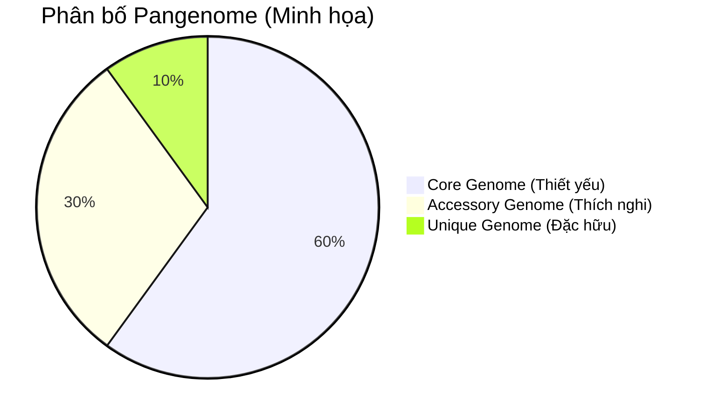
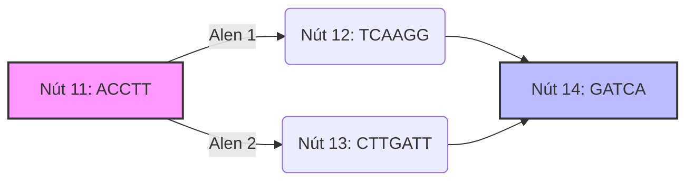

# Cẩm Nang Lý Thuyết Và Phân Tích Hệ Gen Toàn Diện (Pangenomics Guide)

Tài liệu này cung cấp khung lý thuyết nền tảng và hướng dẫn đọc hiểu các báo cáo phân tích, biểu đồ trực quan hóa trong các nghiên cứu ứng dụng **Pangenome** (Hệ gen toàn diện), tập trung vào đối tượng **Nấm (Fungi)** và **Người (Humans)**.

---

## 1. Khái Niệm Cơ Bản Về Pangenome

### 1.1. Từ Hệ Gen Tuyến Tính Đến Pangenome
*   **Hạn chế của hệ gen tham chiếu tuyến tính (Linear Reference Genome):** Phương pháp sinh học phân tử truyền thống căn chỉnh các lượt đọc (reads) từ giải trình tự thế hệ mới (NGS) lên một hệ gen tham chiếu tuyến tính duy nhất (ví dụ: `GRCh38` ở người hoặc `IPO323` của nấm). Phương pháp này bỏ qua các trình tự mới không có trong tham chiếu, tạo ra **sai lệch tham chiếu (reference bias)** và dẫn đến việc đánh giá thiếu các đa hình cấu trúc (Structural Variations - SVs).
*   **Pangenome là gì?** Là tập hợp toàn bộ thông tin di truyền của một nhóm sinh vật (cùng loài hoặc các loài có quan hệ họ hàng gần). Thay vì biểu diễn bằng một chuỗi tuyến tính, pangenome biểu diễn dưới dạng **Đồ thị biến dị (Variation Graph - VG)**, tích hợp các bộ gen đơn haplotype (haplotypes) khác nhau vào một cấu trúc thống nhất.

### 1.2. Phân Nhóm Hệ Gen (Genomic Fractions)
Một pangenome thường được chia thành 3 phần chính dựa trên tần suất xuất hiện của các locus gen di truyền:
1.  **Core Genome (Hệ gen lõi):** Gồm các gen/trình tự có mặt ở hầu hết hoặc tất cả các cá thể nghiên cứu. Các gen này thường đảm nhiệm các chức năng sinh học thiết yếu.
2.  **Accessory/Variable Genome (Hệ gen phụ trợ):** Gồm các gen chỉ xuất hiện ở một số cá thể nhất định. Đây là nguồn gốc tạo nên sự khác biệt về kiểu hình, khả năng kháng thuốc, hoặc khả năng thích nghi môi trường (đặc biệt quan trọng ở các loài nấm gây bệnh).
3.  **Unique/Private Genome (Hệ gen đặc hữu):** Các trình tự chỉ tồn tại ở duy nhất một cá thể.



---

## 2. Mô Hình Hóa Đồ Thị Biến Dị (Variation Graph Model)

Để lưu trữ và tính toán pangenome, cộng đồng tin sinh học sử dụng định dạng **GFA (Graphical Fragment Assembly)**.

### 2.1. Cấu Trúc File GFA (v1.0 và v1.1)
Một đồ thị biến dị bao gồm các thành phần cơ bản:
*   **Segment (S - Nút/Đoạn):** Đại diện cho một đoạn trình tự nucleotide. Mỗi nút có một ID số nguyên duy nhất.
*   **Link (L - Cạnh/Liên kết):** Kết nối giữa hai nút, thể hiện trình tự tiếp diễn. Nó định hướng rõ ràng đầu $5'$ và $3'$ của đoạn nucleotide thông qua ký hiệu hướng (`+` hoặc `-`).
*   **Path (P - Đường đi - GFA v1.0) / Walk (W - Bước đi - GFA v1.1):** Liệt kê danh sách các nút và hướng mà một haplotype (bộ gen của một mẫu cụ thể) đi qua trong đồ thị.

#### Ví dụ cú pháp GFA:
```text
H  VN:Z:1.0
S  11  ACCTT
S  12  TCAAGG
S  13  CTTGATT
L  11  +  12  -  0M
L  12  -  13  +  0M
L  11  +  13  +  0M
P  HaplotypeA  11+,12-,13+
```
> [!NOTE]
> Khi một haplotype đi qua nút `12-`, trình tự thực tế của nó tại vùng đó sẽ là **sự bù nghịch đảo (reverse complement)** của chuỗi nucleotide định nghĩa ở dòng `S 12` (tức là nghịch đảo của `TCAAGG` thành `CCTTGA`).

---

## 3. Các Phương Pháp Xây Dựng Đồ Thị Pangenome

Hiện nay có hai trường phái xây dựng đồ thị chính được sử dụng phổ biến trong các bài báo khoa học:

| Đặc tính | PGGB (Pangenome Graph Builder) | Minigraph-Cactus |
| :--- | :--- | :--- |
| **Triết lý** | Không phụ thuộc hệ gen tham chiếu (Reference-free). | Dựa trên hệ gen tham chiếu làm xương sống (Reference-centric). |
| **Phương pháp** | Đối sánh tất cả với tất cả (All-to-all pairwise alignment) bằng `wfmash`, dựng đồ thị bằng `seqwish` và làm mịn bằng `smoothxg`. | Dựng khung biến dị cấu trúc (SV) bằng `minigraph`, sau đó căn chỉnh chi tiết base-level bằng `Cactus`. |
| **Ưu điểm** | Giữ lại toàn bộ thông tin của mọi bộ gen đầu vào. Rất nhạy với các biến thể cấu trúc lớn và vùng lặp lại phức tạp. | Đồ thị có cấu trúc tuyến tính tốt hơn, dễ mở rộng quy mô bộ gen lớn, lọc bớt sai sót căn chỉnh cục bộ (nhờ cơ chế `--clip`). |
| **Nhược điểm** | Chi phí tính toán cực kỳ lớn. Cấu trúc đồ thị phức tạp hơn, chứa nhiều vòng lặp (cycles) gây khó khăn khi lập chỉ mục. | Thứ tự đưa các bộ gen vào căn chỉnh ảnh hưởng tới hình dáng đồ thị. Có thể bỏ sót các biến dị cực kỳ xa lạ với tham chiếu. |

---

## 4. Hướng Dẫn Đọc Hiểu Biểu Đồ & Phân Tích

Khi đọc các bài báo về pangenome, bạn sẽ thường xuyên bắt gặp các dạng biểu đồ sau:

### 4.1. Biểu đồ mạng lưới (Network Graph Visualizations - Bandage)
*   **Ý nghĩa:** Trực quan hóa toàn bộ hoặc một vùng đồ thị dưới dạng các dải màu kết nối các nút.
*   **Cách đọc:**
    *   **Đường chạy song song (Bubbles):** Đại diện cho các biến thể (SNPs hoặc Indels nhỏ). Đường đi rẽ làm 2 nhánh rồi gộp lại.
    *   **Vòng lặp (Loops / Hairpins):** Đại diện cho các vùng lặp lại (Repeats) hoặc các nhân tố di truyền vận động (Transposable Elements - TEs).
    *   **Nút giao phức tạp (Tangles):** Các vùng siêu biến động có độ tương đồng thấp, nơi nhiều bộ gen có các đoạn chèn dòng khác nhau đi chéo qua nhau.


*Sơ đồ trên biểu diễn một bong bóng biến dị (Variant Bubble) điển hình trong đồ thị.*

### 4.2. Biểu đồ tuyến tính hóa đồ thị 1D (Odgi viz)
*   **Ý nghĩa:** Biểu diễn đồ thị dưới dạng ma trận 1 chiều để phân tích cấu trúc tổng thể và sự đồng thuận giữa các haplotype.
*   **Cách đọc:**
    *   **Trục ngang (X):** Đại diện cho các nút trong đồ thị, được xếp thứ tự tuyến tính hóa (thường bằng thuật toán PG-SGD).
    *   **Các hàng dọc (Y):** Mỗi hàng đại diện cho một haplotype (bộ gen của một mẫu).
    *   **Vệt màu liền mạch:** Thể hiện vùng bảo tồn cao (Core region), nơi tất cả các haplotype đều đi qua các nút giống nhau.
    *   **Vệt màu đứt quãng hoặc ô trắng:** Thể hiện sự mất đoạn (deletion) hoặc chèn dòng đặc thù (insertion) của haplotype đó so với các mẫu khác.
    *   **Màu sắc thay đổi đột ngột (hoặc đảo chiều mũi tên):** Biểu thị sự đảo đoạn (inversion) hoặc chuyển vị (translocation).

### 4.3. Sơ đồ dạng ống tàu điện ngầm (SequenceTubeMap)
*   **Ý nghĩa:** Biểu diễn chi tiết đường đi của từng haplotype ở quy mô nhỏ (cấp độ nucleotide hoặc exon/gene).
*   **Cách đọc:**
    *   Mỗi đường line màu đại diện cho hành trình của một mẫu genome cụ thể.
    *   Khi các đường chập lại làm một ống dày: vùng đó trình tự giống hệt nhau.
    *   Khi các đường tách ra thành nhiều nhánh song song: các alen khác nhau đang tồn tại tại locus đó.

---

## 5. Quy Trình Phân Tích Biến Dị Với Pangenome

Một quy trình phân tích NGS chuẩn sử dụng pangenome thường bao gồm các bước sau:

1.  **Xây dựng đồ thị (Graph Construction):** Sử dụng `PGGB` hoặc `Minigraph-Cactus` từ dữ liệu lắp ráp bộ gen chất lượng cao (PacBio/Nanopore de novo assemblies).
2.  **Lập chỉ mục đồ thị (Graph Indexing):** Tạo các file chỉ mục hỗ trợ tìm kiếm nhanh như `.gbz` (đồ thị nén), `.dist` (khoảng cách giữa các nút), `.min` (dữ liệu minimizer) bằng `vg autoindex`.
3.  **Ánh xạ lượt đọc ngắn (Short-read Mapping):** Dùng `vg giraffe` để ánh xạ dữ liệu Fastq trực tiếp lên đồ thị pangenome đã lập chỉ mục. Bước này loại bỏ hoàn toàn sai lệch tham chiếu vì reads có cơ hội căn chỉnh vào các nhánh biến dị của các haplotype khác nhau.
4.  **Chiếu ngược hệ tọa độ (Surjection):** Vì các công cụ phân tích hạ nguồn (downstream) thường chỉ đọc định dạng BAM/SAM tuyến tính, lệnh `vg surject` được dùng để chiếu các căn chỉnh từ đồ thị về hệ tọa độ của một bộ gen tham chiếu cụ thể (ví dụ: `IPO323` của nấm).
5.  **Xác định kiểu gen và gọi biến thể (Variant Calling):** Dùng `vg call` kết hợp với thông tin bao gói `vg pack` để phát hiện SNPs, Indels và đặc biệt là các biến dị cấu trúc (SVs) phức tạp.

---

## 6. Lưu Ý Đặc Thù Đối Với Nghiên Cứu Nấm (Fungi)
*   **Đặc điểm sinh học của Nấm:** Nấm có kích thước bộ gen tương đối nhỏ (thường từ 30MB - 120MB) nhưng sở hữu cấu trúc bộ gen cực kỳ linh hoạt với nhiều nhân tố lặp lại (transposons), hiện tượng mất/nhập đoạn lớn và trao đổi gen ngang (Horizontal Gene Transfer).
*   **Hiện tượng nấm tạp nhiễm (Contaminants):** Trong các nghiên cứu nấm tạp, pangenome giúp phân biệt chính xác các đoạn gen thuộc về hệ gen nấm mục tiêu với các sinh vật tạp nhiễm nhờ so sánh hành trình của reads trên các nhánh đồ thị đặc trưng.
*   **Phân tích vùng cụm gen trao đổi chất (Secondary Metabolite Gene Clusters - SMGCs):** Các vùng gen này thường nằm ở vùng cận telomere hoặc vùng siêu biến động. Sử dụng biểu đồ đồ thị con (sub-graph) trích xuất bằng `odgi extract` hay `vg find` cho phép phân tích tính toàn vẹn của cụm gen này trên các chủng nấm khác nhau mà không bị ảnh hưởng bởi lỗi lắp ráp hoặc thiếu thông tin trên hệ gen tham chiếu.

---

## Tài Liệu Tham Khảo (References)

1.  **Matthews, C. A., Watson-Haigh, N. S., Burton, R. A., & Sheppard, A. E. (2024).** *A gentle introduction to pangenomics.* Briefings in Bioinformatics, 25(6), bbae588. [https://doi.org/10.1093/bib/bbae588](https://doi.org/10.1093/bib/bbae588)
2.  **Garrison, E., Guarracino, A., Heumos, S., et al. (2023).** *Building pangenome graphs.* bioRxiv, 2023.04.05.535718. [https://doi.org/10.1101/2023.04.05.535718](https://doi.org/10.1101/2023.04.05.535718)
3.  **Hickey, G., Monlong, J., Ebler, J., et al. (2023).** *Pangenomic analysis of genomic variation using Minigraph-Cactus.* Nature Biotechnology, 42, 630-637. [https://doi.org/10.1038/s41587-023-01793-w](https://doi.org/10.1038/s41587-023-01793-w)
4.  **Tài liệu hướng dẫn thực hành:** *Giới thiệu hướng dẫn - Cuộc thi lập trình Pangenome Hackathon (INRAE BioinfOmics, 2024).* [Giới thiệu hướng dẫn - Cuộc thi lập trình Pangenome Hackathon.html](file:///mnt/d/1.HocViec/theory_and_resources/pangenom/reference/Gi%E1%BB%9Bi%20thi%E1%BB%87u%20h%C6%B0%E1%BB%9Bng%20d%E1%BA%ABn%20-%20Cu%E1%BB%99c%20thi%20l%E1%BA%ADp%20tr%C3%ACnh%20Pangenome%20Hackathon.html)
