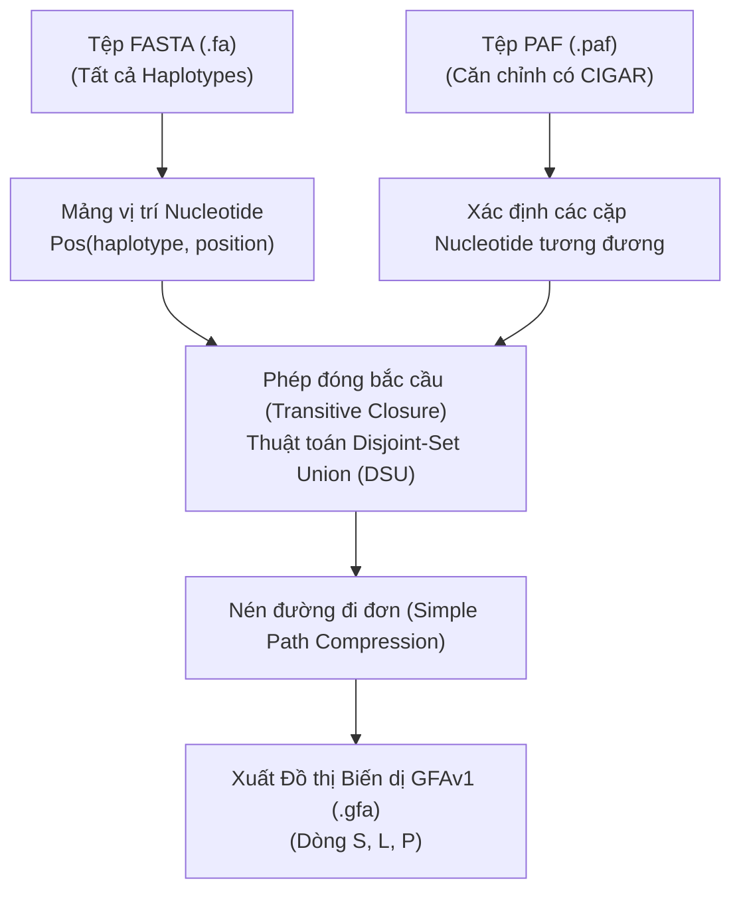

# 📖 CẨM NANG HƯỚNG DẪN CÁC CÔNG CỤ THÀNH PHẦN TRONG PGGB PIPELINE

Tài liệu này tổng hợp hướng dẫn, cơ sở lý thuyết, thuật toán và chi tiết **các tham số mặc định (default parameters)** của từng công cụ sinh tin học riêng lẻ phục vụ cho pipeline **PGGB (Pangenome Graph Builder)**.

---

## 🛠️ 1. CÔNG CỤ `wfmash` (ALL-VS-ALL MAPPER & WAVEFRONT ALIGNER)

### 1.1. Mục Đích Cốt Lõi
Công cụ **`wfmash`** (kết hợp giữa *MashMap* và *Wavefront Alignment - WFA*) đảm nhận bước mở đầu trong pipeline PGGB. Mục đích chính của `wfmash` là thực hiện **Alignment tất cả các trình tự với nhau** (tổ hợp tất cả các cặp $N \times (N-1)/2$ giữa các bộ gen đơn bội/contig đầu vào) nhằm xây dựng một pangenome hoàn toàn không phụ thuộc vào hệ gen tham chiếu (*Reference-Free*).

### 1.2. Thách Thức Tính Toán & Lý Thuyết MinHash Của Broder
*   **Thách thức độ phức tạp:** So sánh trực tiếp từng nucleotide (`A, T, C, G`) của tất cả các trình tự dài hàng triệu đến hàng tỷ base pair có độ phức tạp bùng nổ ($\mathcal{O}(N^2 \cdot M^2)$), tốn khổng lồ tài nguyên CPU và RAM.
*   **Giải pháp MinHash của Broder (1997):**
    1.  *Cắt phân đoạn & Hash:* Cắt contig theo cửa sổ `-s 5000` bp và băm các k-mer thành số nguyên 64-bit qua hàm băm ngẫu nhiên $h$.
    2.  *Minimizer Hash Min:* Dùng cửa sổ trượt $w$ chọn k-mer có giá trị băm nhỏ nhất (**Hash Min**) làm đại diện cho phân đoạn.
    3.  *Định lý Broder (Broder's Theorem):* Xác suất để hai phân đoạn gen có cùng giá trị Hash Min chính bằng chỉ số tương đồng Jaccard $J(A, B)$ thực sự:
        $$\mathbb{P}\left[ h_{\min}(A) == h_{\min}(B) \right] = \frac{|A \cap B|}{|A \cup B|} = J(A, B)$$
    4.  *Lọc nhiễu siêu tốc:* Cho phép so sánh các tập Hash Min nhỏ gọn để ước tính chỉ số ANI (`-p 90%`) và **lọc bỏ 95% các vùng gen không tương đồng** mà không tốn thời gian đọc lại chuỗi ký tự DNA ban đầu.

### 1.3. Gióng Hàng Chi Tiết Base-Level & Gọi Biến Dị
1.  **Kích hoạt Thuật toán WFA (Wavefront Alignment):** Mở rộng cửa sổ xung quanh các cột mốc Minimizer Hash Min và gọi thuật toán WFA để quét, so sánh trực tiếp **từng ký tự nucleotide (`A, T, C, G`)**.
2.  **Bóc tách và Gọi biến dị (Calling / Splitting Variants):** 
    WFA ghi chép chính xác $100\%$ từng điểm sai khác di truyền vào xâu CIGAR của tệp căn chỉnh PAF (`.paf`):
    *   **Đột biến điểm (SNVs):** Thay đổi nucleotide đơn lẻ ($A \rightarrow G$).
    *   **Chèn / Mất đoạn (Indels):** Đoạn chèn hoặc thiếu hụt nucleotide ngắn.
    *   **Biến dị cấu trúc lớn (Structural Variants - SVs):** Phát hiện các vùng **Đảo đoạn (Inversions)** khi trật tự tập Hash Min bị xoay ngược giữa hai mẫu (ví dụ: Mẫu A là $95 \rightarrow 300$, Mẫu B là $300 \rightarrow 95$).

### 1.4. Bảng Tham Số Mặc Định Của `wfmash`
| Tham số CLI | Tên tham số đầy đủ | Giá trị mặc định | Ý nghĩa sinh học & thuật toán |
| :--- | :--- | :---: | :--- |
| **`-s`** | `--segment-length` | **`5000`** (5k bp) | Độ dài phân đoạn contig cắt nhỏ để thực hiện Minimizer Sketch mapping. |
| **`-l`** | `--block-length` | **`15000`** ($3 \times s$) | Độ dài khối căn chỉnh tích lũy tối thiểu để chấp nhận một đường gióng hàng. |
| **`-p`** | `--map-pct-id` | **`90`** (90% ANI) | Ngưỡng độ tương đồng nucleotide trung bình tối thiểu giữa các dải hạt giống. |
| **`-n`** | `--n-mappings` | **`N - 1`** | Số lượng dải căn chỉnh tốt nhất giữ lại cho mỗi phân đoạn ($N$ = số haplotype). |
| **`-K` / `-k`** | `--mash-kmer` / `--kmer-size` | **`19`** (19-mers) | Kích thước k-mer băm số nguyên trong Minimizer Sketching. |
| **`-F`** | `--filter-freq` | **`0.001`** (0.1%) | Loại bỏ top 0.1% các k-mer xuất hiện tần suất cao nhất (tránh nhiễu vùng lặp). |
| **`-c`** | `--chain-gap` | **`2000`** (2k bp) | Khoảng cách tối đa để nối các seed mapping liên tiếp thành một dải căn chỉnh. |
| **`-g`** | `--wfa-params` | **`5,8,2,24,1`** | Trọng số điểm số cho WFA (mismatch, gap1_open, gap1_ext, gap2_open, gap2_ext). |

---

## 🕸️ 2. CÔNG CỤ `seqwish` (VARIATION GRAPH INDUCER)

### 2.1. Mục Đích & Vai Trò
Công cụ **`seqwish`** đóng vai trò trái tim trong bước chuyển đổi hạ tầng của PGGB. `seqwish` nhận tệp căn chỉnh PAF (`.paf`) từ `wfmash` và tệp chuỗi FASTA ban đầu để **khởi tạo đồ thị biến dị thô (Variation Graph)** hoàn toàn không phụ thuộc vào hệ gen tham chiếu (*Reference-Free*), lưu trữ dưới định dạng chuẩn **GFAv1** (`.gfa`).

---

### 2.2. Bản Chất Thuật Toán: Alignment Graph Induction & Transitive Closure

Khác với các công cụ dựng đồ thị dựa trên k-mer (de Bruijn graph) hoặc dựa trên genome tham chiếu (như `minigraph`), `seqwish` áp dụng thuật toán **Alignment Graph Induction** với 3 bước cốt lõi:

1. **Khởi tạo không gian vị trí (Positional Space Construction)**:
   - Tất cả các chuỗi nucleotide trong tệp FASTA được biểu diễn trên mảng tọa độ 1D liên tục. Mỗi base tại vị trí $p$ trên chuỗi $i$ được định danh duy nhất $Pos(i, p)$.
2. **Phép đóng bắc cầu (Transitive Closure via Disjoint-Set Union / Union-Find)**:
   - Chuỗi CIGAR trong tệp PAF chỉ ra các cặp base **khớp chính xác (Match `=` / `M`)**.
   - Nếu $A \sim B$ (base $A$ tương đương base $B$) và $B \sim C$, tính chất bắc cầu kết luận $A \sim C$.
   - `seqwish` ứng dụng cấu trúc dữ liệu **Disjoint-Set Union (DSU)** để gộp các vị trí nucleotide tương đương thành các **Tập hợp tương đương (Equivalence Class)**, tương ứng với một **Đỉnh (Node / Segment 'S')** trong đồ thị.
3. **Thu nén đường đi và xuất định dạng GFAv1**:
   - **Segment (Dòng `S`)**: Các nucleotide đứng cạnh nhau trên chuỗi ban đầu và không phân nhánh được nén thành đoạn Segment dài hơn.
   - **Link (Dòng `L`)**: Cạnh định hướng thể hiện sự nối tiếp giữa các Node.
   - **Path (Dòng `P`)**: Đường đi khôi phục lại hoàn toàn trình tự ban đầu của từng genome/haplotype.

---

### 2.3. Phân Tích Bộ Tham Số CLI & Chiến Lược Điều Chỉnh (Parameter Tuning)

#### 2.3.1. Bảng Tra Cứu Bộ Tham Số CLI

| Tham số CLI | Tên tham số đầy đủ | Giá trị mặc định | Ý nghĩa sinh học & thuật toán |
| :--- | :--- | :---: | :--- |
| **`-s`** | `--fasta` | *(Bắt buộc)* | Tệp FASTA đầu vào chứa tất cả chuỗi haplotype. Yêu cầu tệp chỉ mục `.fai` (`samtools faidx`). |
| **`-p`** | `--paf` | *(Bắt buộc)* | Tệp căn chỉnh PAF chứa chuỗi CIGAR (Cột 12 - tag `cg:Z:`). |
| **`-g`** | `--gfa` | *(Bắt buộc)* | Đường dẫn tệp GFAv1 đầu ra. |
| **`-k`** | `--min-match-len` | **`19`** | Độ dài chuỗi khớp tối thiểu (bp) để thực hiện transclose. Lọc nhiễu vi trùng khớp ngẫu nhiên. |
| **`-B`** | `--transclose-batch` | **`10000000`** (10M) | Số lượng liên kết/dữ liệu nạp vào RAM ở mỗi chu kỳ transclose. |
| **`-f`** | `--sparse-factor` | **`0`** | Hệ số thưa của mảng chỉ mục vị trí (`posic`), giúp giảm dung lượng RAM cho mảng con trỏ. |
| **`-t`** | `--threads` | **`1`** | Số luồng CPU tính toán song song. |

#### 2.3.2. Chiến Lược Điều Chỉnh Tham Số `-k` và `-B` Theo Đối Tượng Sinh Học

| Đối tượng sinh học | Quy mô Genome | Đặc điểm di truyền | Khuyến nghị `-k` | Khuyến nghị `-B` | Rationale (Cơ sở khoa học) |
| :--- | :--- | :--- | :---: | :---: | :--- |
| **Nấm (Fungi)** | 10 – 50 Mb | Đa dạng di truyền cao, phân hóa xa, nhiều micro-indels | **`7 – 19`** | **`10M – 50M`** | `-k` nhỏ giữ lại các đoạn tương đồng ngắn giữa các chủng phân hóa xa; RAM không phải nút thắt cổ chai. |
| **Người (Humans)** | ~3.1 Gb/hap | Đa dạng trung bình (~0.1%), giàu yếu tố lặp lại (LINE/SINE, Centromere) | **`29 – 79`** | **`20M – 50M`** | `-k` lớn loại bỏ các vi-trùng-khớp nhiễu do vùng repeat gây ra búi tóc rối (tangled hairballs); chia nhỏ batch tránh bùng nổ RAM (OOM). |

---

## 🎨 3. CÔNG CỤ `smoothxg` (POA GRAPH SMOOTHER)

### 3.1. Mục Đích & Vai Trò
*   Đồ thị thô xuất từ `seqwish` thường gặp hiện tượng "búi mì spaghetti" chằng chịt do vi lặp ngắn. **`smoothxg`** chịu trách nhiệm **làm mịn đồ thị** bằng cách gom các vùng đồng tuyến thành các khối **POA (Partial Order Alignment)** sạch sẽ.

### 3.2. Thuật Toán Cốt Lõi
*   **Chia Khối POA (Block Building):** Phân chia đồ thị thô thành các khối collinear blocks.
*   **Partial Order Alignment (POA):** Căn chỉnh cục bộ theo thứ tự bán phần trên từng khối, giúp hợp nhất các biến đổi điểm (SNVs) và Indels nhỏ thành các bong bóng (bubbles) tiêu chuẩn.

### 3.3. Bảng Tham Số Mặc Định Của `smoothxg`
| Tham số CLI | Tên tham số đầy đủ | Giá trị mặc định | Ý nghĩa sinh học & thuật toán |
| :--- | :--- | :---: | :--- |
| **`-G`** | `--poa-length-target` | **`700,900,1100`** | Kích thước chuỗi mục tiêu cho các chu kỳ Partial Order Alignment (POA). |
| **`-P`** | `--poa-params` | **`asm5`** | Bảng điểm POA (`1,19,39,3,81,1` tương đương mức phân hóa di truyền ~0.1%). |
| **`-O`** | `--poa-padding` | **`0.001`** | Tỷ lệ đệm 2 đầu chuỗi trong bài toán POA (tính theo độ dài chuỗi trung bình). |

---

## 📊 4. CÔNG CỤ `odgi` (OPTIMIZED DATA-STRUCTURES FOR GRAPH INSPECTION)

### 4.1. Mục Đích & Vai Trò
*   **`odgi`** là bộ công cụ tối ưu hóa dữ liệu đồ thị pangenome, hỗ trợ chuyển đổi định dạng nhị phân `.og`, sắp xếp tọa độ 1D, tính toán thống kê và trực quan hóa biểu đồ 1D/2D.

### 4.2. Các Mô-đun Cốt Lõi
*   **`odgi build`:** Chuyển đổi file GFA văn bản sang định dạng nhị phân `.og` truy xuất siêu tốc.
*   **`odgi sort -p Ygs`:** Sắp xếp lại thứ tự node 1D bằng thuật toán **Path-Guided Stochastic Gradient Descent (PG-SGD)**.
*   **`odgi viz`:** Xuất ma trận trực quan hóa 1D (multiqc, depth, inv, pos).
*   **`odgi layout & draw`:** Tính toán bố cục không gian 2D và vẽ sơ đồ mạng lưới đồ thị PNG/SVG.

---

## ✂️ 5. CÔNG CỤ `gfaffix` (GRAPH AFFIX COLLAPSER)

### 5.1. Mục Đích & Vai Trò
*   **`gfaffix`** thực hiện thu gọn các đoạn nhánh đầu (prefix) và đoạn nhánh đuôi (suffix) dư thừa trùng lặp trên đồ thị GFA sau bước `smoothxg`, giúp giảm tối đa độ phức tạp của đồ thị.

---

## 🔬 6. CÔNG CỤ `vg` (VARIATION GRAPH TOOLKIT)

### 6.1. Mục Đích & Vai Trò
*   Bộ công cụ toàn năng phân tích pangenome. Trong PGGB, `vg` chủ yếu đảm nhận nhiệm vụ **Trích xuất biến dị (Variant Calling)** thông qua mô-đun `vg deconstruct`.

### 6.2. Lệnh Cốt Lõi: `vg deconstruct`
*   So sánh tất cả các đường đi (paths) trên đồ thị đối chiếu với một Hệ gen tham chiếu chỉ định (`-P ref -H "#"`), xuất ra tệp biến dị chuẩn **VCF (`.vcf`)**.

---

## 📖 Nguồn Tham Khảo (References)

1. **Broder, A. Z. (1997).** *On the resemblance and containment of documents.* IEEE Compression and Complexity of Sequences, 21–29. [https://doi.org/10.1109/SEQUEN.1997.666900](https://doi.org/10.1109/SEQUEN.1997.666900)
2. **Marco-Sola, S., et al. (2021).** *The wavefront sequence alignment algorithm (WFA).* Bioinformatics, 37(4), 456–463. [https://doi.org/10.1093/bioinformatics/btaa777](https://doi.org/10.1093/bioinformatics/btaa777)
3. **Garrison, E., Guarracino, A., et al. (2023).** *Variation graph induction with seqwish.* Bioinformatics, 39(1), btac810. [https://doi.org/10.1093/bioinformatics/btac810](https://doi.org/10.1093/bioinformatics/btac810)
4. **Guarracino, A., Heumos, S., Garrison, E., et al. (2022).** *ODGI: understanding pangenome graphs.* Bioinformatics, 38(13), 3319–3326. [https://doi.org/10.1093/bioinformatics/btac308](https://doi.org/10.1093/bioinformatics/btac308)
5. **Tài liệu dự án liên quan:** [PGGB.md](file:///home/vkhang-bui/1.HocViec/projects/pangenom/documents/PGGB.md) và [lo_trinh_hoc_pangenome.md](file:///home/vkhang-bui/1.HocViec/projects/pangenom/documents/lo_trinh_hoc_pangenome.md).
